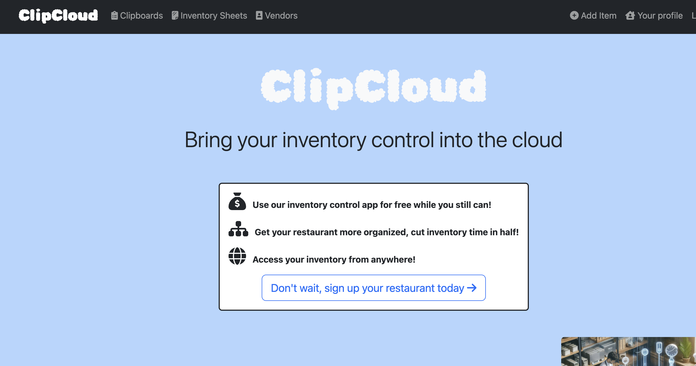
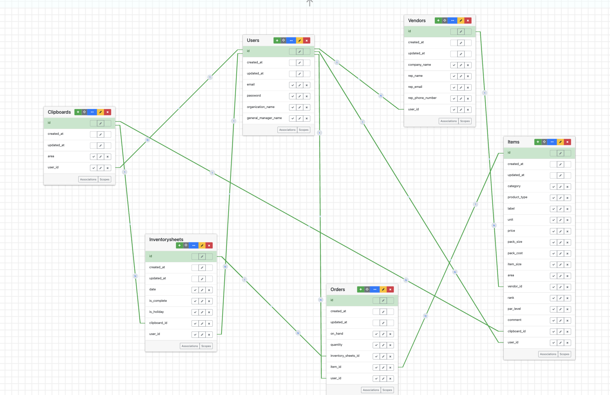

 

  
  <h1>ClipCloud</h1>
  
A Inventory Control App For Restaurants

  

     
    <a href="https://github.com/salcasta/clipboards-project"><strong>Explore the docs »</strong></a>
     
     
    <a href="https://www.loom.com/share/5915d059d9264424b244e0835e5a5a58?sid=cf3b4fcc-1bab-4ea1-aa48-229ef29eab12">View Demo</a>
    ·
    <a href="https://github.com/salcasta/clipboards-project/issues/new">Request Feature</a>
  

  
Table of Contents

  <ol>
    <li>
      <a href="#about-the-project">About The Project</a>
      <ul>
        <li><a href="#built-with">Built With</a></li>
      </ul>
    </li>
    <li>
      <a href="#getting-started">Getting Started</a>
      <ul>
        <li><a href="#development">Development</a></li>
        <li><a href="#production">Production</a></li>
      </ul>
    </li>
    <li><a href="#faq">F.A.Q</a></li>
    <li><a href="#erd">ClipCloud's ERD</a></li>
    <li><a href="#github-projects">Github Projects</a></li>
    <li><a href="#contributing">Contributing</a></li>
    <li><a href="#contact">Contact</a></li>
    <li><a href="#acknowledgments">Acknowledgments</a></li>
  </ol>

## About The Project

A cloud-based inventory control app built for restaurants 

Benefits:
* Easy to use 
* Save time doing inventory
* Access your inventory from anywhere

(<a href="#readme-top">back to top</a>)

### Built With

This section should list any major frameworks/libraries used to bootstrap your project. Leave any add-ons/plugins for the acknowledgements section. Here are a few examples.

* [Ruby on Rails Guide][https://guides.rubyonrails.org/index.html]
* [Bootstrap][https://getbootstrap.com/]

(<a href="#readme-top">back to top</a>)

## Getting Started

Very easy to set up 

### Development

1. Fork the repository 
2. Run <code>rake sample_data</code> in the terminal (will take a few seconds to complete)
3. Run <code>bin/dev</code> in the terminal to run project locally 
4. Go to "ports" and click on a forwarded address
5. login 
  * email: test@test.com
  * password: password

### Production

To view a demo account 
1. Go to ClipCloud [ClipCloud](https://clipcloud.onrender.com/)
2. login 
  * email: salcasta.dev.test@gmail.com
  * password: 21SDF2024 (casing matters)

1. Go to ClipCloud [ClipCloud](https://clipcloud.onrender.com/)
2. Sign up
3. Create a clipboard
4. Create an inventory sheet
5. Start to add your items (as you add your items, they will populate the the corresponding inventory sheets)
6. (optional) Add your vendors

To make an order
1. Go to one of your inventory sheets (clicking view)
2. Click on "Make/edit an order"
3. Complete the form
4. Your order will be visible at the bottom of the corresponding inventory sheet

(<a href="#readme-top">back to top</a>)

## FAQ

  
Why does it take forever to launch the app?

  <ol>
    
The app is being hosted by Render, so if the app is not being accessed it will "spin down" and take 30-60 seconds to launch

  </ol>

  
What will happen to my data if I delete a clipboard?

  <ol>
    
Be careful when deleting a clipboard! All inventory sheets/orders tied to that clipboard will be deleted as well. Items will remain but you will need to reassign every item again

  </ol>

  
What should I do if I encounter an error?

  <ol>
    
If an error comes up while using the app, please contact the lead developer via LinkedIn found in the "contact" section

  </ol>

(<a href="#readme-top">back to top</a>)

## ERD

This is a screenshot of the ERD 

(<a href="#readme-top">back to top</a>)

## Github Project

Here is a link to my workflow for ClipCloud [Github Project](https://github.com/users/salcasta/projects/1)

(<a href="#readme-top">back to top</a>)

## Contributing

Contributions are what make the open source community such an amazing place to learn, inspire, and create. Any contributions you make are **greatly appreciated**.

If you have a suggestion that would make this better, please fork the repo and create a pull request. You can also simply open an issue with the tag "enhancement".
Don't forget to give the project a star! Thanks again!

1. Fork the Project
2. Creat an issue for the feature (https://github.com/salcasta/clipboards-project/issues)
3. Create your Feature Branch (`git checkout -b your_iniitals-issue_number-AmazingFeature`)
4. Commit your Changes (`git commit -m 'Add some AmazingFeature'`)
5. Push to the Branch (`git push origin feature/AmazingFeature`)
6. Open a Pull Request

(<a href="#readme-top">back to top</a>)

## Contact

Salvador Castaneda - [Linkedin](www.linkedin.com/in/salcasta)

Project Link: [Github Repo](https://github.com/salcasta/clipboards-project)

(<a href="#readme-top">back to top</a>)

## Acknowledgments

A very big thank you to everyone at DPI, especially Thierry and Carlos

(<a href="#readme-top">back to top</a>)

